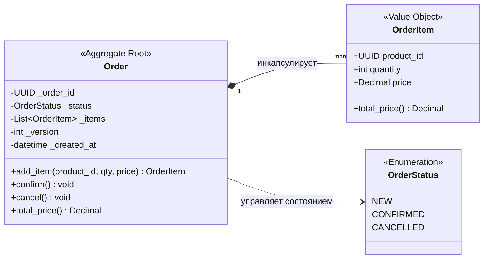
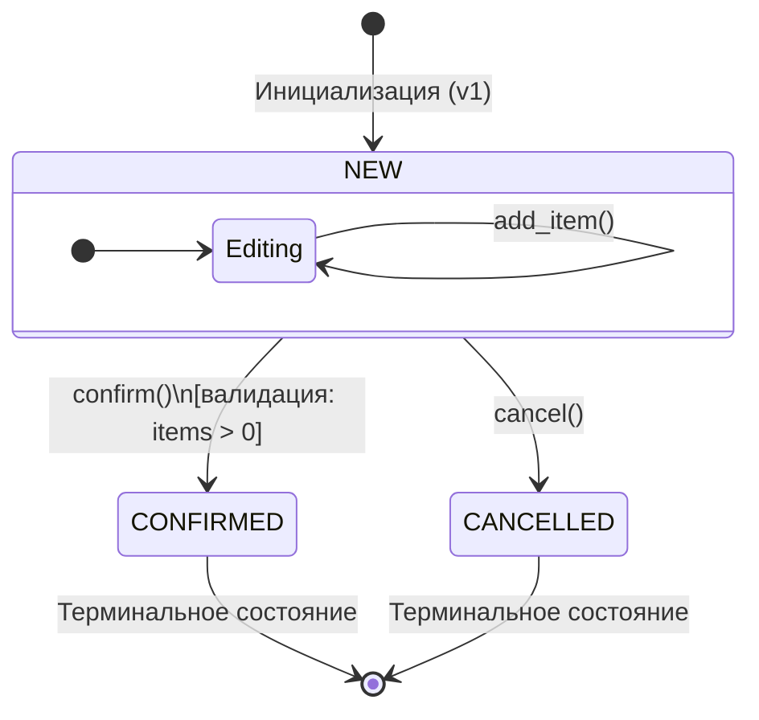

# Документация доменной модели: Order Aggregate

## 1. Обзор (Overview)
**Агрегат Заказа (Order Aggregate)** — это ключевая бизнес-сущность системы, отвечающая за процесс оформления покупки. 

* **Aggregate Root**: `Order`
* **Internal Value Objects**: `OrderItem`

Агрегат гарантирует, что все бизнес-правила (инварианты) соблюдаются в любой момент времени. Изменение состава заказа возможно **только** через методы корневого объекта `Order`.

---

## 2. Структурная схема (UML Class Diagram)

Диаграмма описывает внутреннюю структуру агрегата и типы используемых данных.

## 3. Жизненный цикл (State Machine)

Заказ проходит через строго определенные состояния. Переходы регулируются правилами валидации и защиты инвариантов.

| Метод    | Состояние NEW            | Состояние CONFIRMED | Состояние CANCELLED |
|----------|--------------------------|---------------------|---------------------|
| add_item | Успех                    | ValueError          | ValueError          |
| confirm  | Успех (если есть товары) | ValueError          | ValueError          |
| cancel   | Успех                    | ValueError          | Игнорируется        |

## 4. Бизнес-инварианты (Domain Rules)

Ниже приведен список критических бизнес-правил, которые агрегат обязан соблюдать для обеспечения целостности данных.

| ID        | Правило                    | Описание                                                                                                                                                    | Реализация                               |
|:----------|:---------------------------|:------------------------------------------------------------------------------------------------------------------------------------------------------------|:-----------------------------------------|
| **BR-01** | **Финансовая точность**    | Все денежные расчеты (цена, итоговая сумма) должны проводиться исключительно с использованием типа `Decimal` для предотвращения ошибок округления `float`.  | `OrderItem.price`, `Order.total_price()` |
| **BR-02** | **Минимальное наполнение** | Заказ не может быть переведен в статус `CONFIRMED`, если в нем нет ни одной товарной позиции.                                                               | `Order.confirm()`                        |
| **BR-03** | **Защита от модификаций**  | После того как заказ перешел в финальное состояние (`CONFIRMED` или `CANCELLED`), любое изменение его состава (добавление/слияние товаров) запрещено.       | `Order._ensure_editable()`               |
| **BR-04** | **Автоматическое слияние** | При добавлении товара, который уже присутствует в заказе по той же цене, система обязана увеличить количество в существующей позиции, а не создавать новую. | `Order.add_item()`                       |
| **BR-05** | **Валидация VO**           | Объект `OrderItem` не может существовать с отрицательной ценой или количеством меньше или равным нулю.                                                      | `OrderItem.__post_init__`                |

---

## 5. Технические особенности реализации

### Контроль версий и конкурентность
Для обеспечения целостности при параллельном доступе используется механизм **Optimistic Concurrency Control**:
* Атрибут `_version` инкрементируется при каждом изменении состояния заказа.
* Метод `_touch()` обновляет метку времени `_updated_at` и увеличивает номер версии.
* Это позволяет репозиториям проверять версию при сохранении, предотвращая потерю данных ("Lost Update").

### Глубокая инкапсуляция (Deep Encapsulation)
Агрегат спроектирован так, чтобы его состояние нельзя было нарушить извне:
1. **Защита коллекции**: Внутреннее хранилище `_items` доступно снаружи только как `tuple`. Попытки вызвать `.append()` или `.pop()` на свойстве `items` приведут к ошибке.
2. **Защитное копирование**: Конструктор принимает `list[OrderItem]`, но создает его локальную копию, разрывая связь с внешним объектом, который мог бы быть изменен за пределами класса.
3. **Память и Slots**: Использование `__slots__` в `Order` и `OrderItem` минимизирует потребление памяти при работе с большим количеством объектов.

### Идентичность и Хеширование
* **Сущность (Entity)**: `Order` определяется своим `order_id`. Два объекта заказа с одинаковым ID считаются равными, даже если их статусы или составы временно различаются. Хеш заказа остается стабильным на протяжении всего жизненного цикла.
* **Объект-значение (Value Object)**: `OrderItem` полностью определяется своими данными. Изменение любого поля (например, количества) делает его другим объектом.